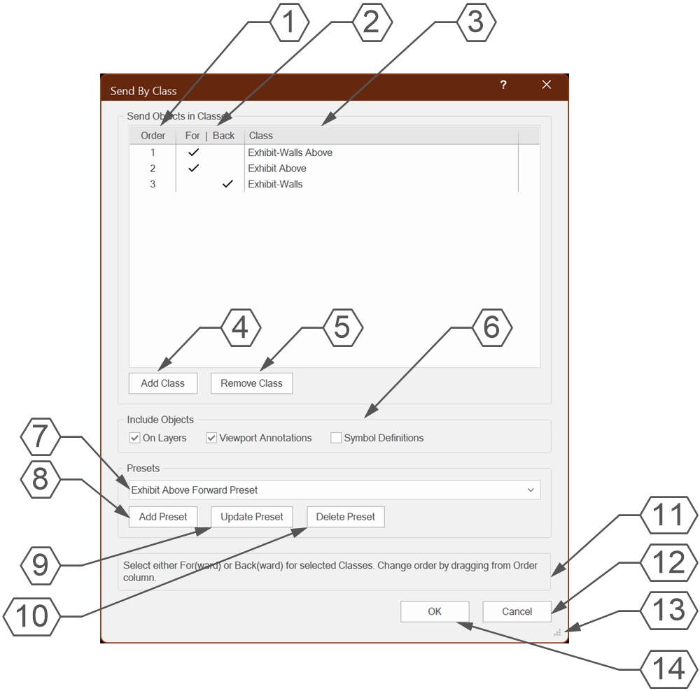
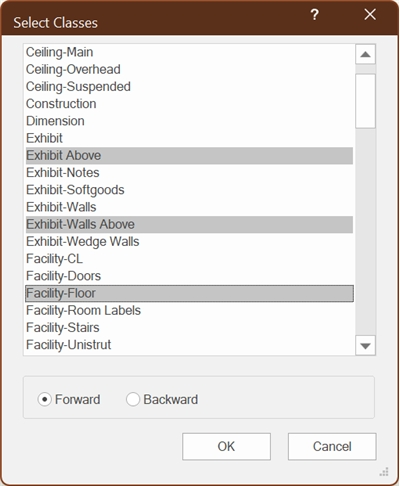

# Send By Class

Menu Command

## Version

**1.1.0** - 7/17/2026

This plug-in is written in Vectorscript (Pascal) and can be used in any version of [Vectorworks](https://www.vectorworks.net) 2019 or newer.

## Description

This menu command opens a dialog box allowing the user to send objects of chosen Classes forward to front or backward to back. There are options for objects on Design/Sheet Layers, within Symbol Definitions.

## Instructions

1. Run the **Send By Class** menu command.
1. Press the **Add Class** button to open a dialog box to select Classes to add to the dialog List Browser.
1. Select at least one Class to add. Multiple Class may be selected at once.
1. Choose an initial send direction, **Forward** is selected by default.
1. Press **OK** to cloase the sub-dialog and add selected Classes to the List Browser.
1. Check the **For**(ward) or **Back**(ward) columns for each Class depending on desired direction.
1. Click and drag from the **Order** column to set operation order. The command will execute from top to bottom, so objects in Classes with a higher **Order** will be "more forward/backward" than Classes with a lower **Order**.
1. Check the **On Layers** option to include objects on Design or Sheet Layers.
1. Check the **Viewport Annotations** option to include objects inside of Viewport Annotation spaces. This option requires that **On Layers** also be checked.
1. Check the **Symbol Definitions** option to include objects inside of Symbol Definitions. If **On Layers** is unchecked, **Symbol Definitions** will be automatically checked and locked.
1. Press **Add Preset** to save current Class settings to a **Preset** for easy and fast recall later.
1. Press **OK** to close the dialog box and send objects depending on set options. Pressing **OK** will also save all **Preset** changes.

## Main Dialog Box Explanation

1. Operation order. Menu command will execute from top to bottom, with objects in Classes with a higher **Order** value being "more forward/backward" than objects in Classes with a lower **Order** value. Click and drag from this column to change the order for selected Classes.
1. Check either the **For**(ward) or **Back**(ward) column to determine send direction.
1. Chosen Class name.
1. Press **Add Class** to open **Select Classes** dialog to add Classes to the List Browser above.
1. Press **Remove Class** to remove selected Classes from the List Browser.
1. Options determining which objects will be sent.
    1. **On Layers** will send all objects on Design and Sheet Layers matching chosen Classes.
    1. **Viewport Annotations** will send all objects within Viewport Annotations. This option requires that **On Layers** also be checked.
    1. **Symbol Definitions** will send all objects inside Symbol Definitions matching chosen Classes. Please note that this will *every* object within *every* Symbol Definition in the active drawing, so this operation may take more time depending on the number and complexity of Symbols and how many Classes have been chosen.
1. Selecting a **Preset** from the drop-down will load Class and Include settings from a saved **Preset**.
1. Press **Add Preset** to store current Class and Include settings into a new **Preset**.
1. Press **Update Preset** to update the currently selected **Preset** with the current Class and Include settings.
1. Press **Delete Preset** to delete the currently selected **Preset**. This operation will only be finalized by pressing the **OK** button.
1. **Help Box**. Mousing over any dialog box element will display an explanation of the element here.
1. Press **Cancel** to close the dialog box without sending any objects.
1. Click and drag this handle to resize the dialog box.
1. Press **OK** to close the dialog and begin the sending operation.

## Select Classes Dialog

1. Enter text into the search box to filter Classes containing the text. Capitalization is ignored.
1. Classes with matching text from the search box will populated in the list box. If the search box is empty, the list box should display all Classes in the active drawing not already in the main dialog box.
    - Clicking on a Class will select that Class, clicking again will deselect that Class.
    - Multiple Classes can be selected/deselected at a time using the **Shift** key or the **Ctrl**/**Command** keys.
    - A selected class will appear <mark style="background-color: blue; color:white">highlighted</mark>.
1. The direction radio buttons at the bottom of the dialog will apply to *all* of the selected Classes above. This can be changed later by checking the proper column in the main dialog box.
1. Press the **OK** button to close the dialog box and add selected Classes to the main dialog box.
1. Press the **Cancel** button to close the dialog box without adding Classes to the main dialog box.

## Presets

As of version **1.1.0**, different combinations of Classes, send directions, and Include Objects options can be stored in "**Presets**" for quick and easy recall. These **Presets** are stored in the active drawing as Worksheet resources in a folder called **Send By Class Presets**. The tool looks specifically for Worksheets in this folder, so it is advised not to move them.

These **Presets** are not fully stored until the **OK** button is pressed on the main dialog box.  Instead, temporary Worksheets are created with a **tmp** prefix to store the settings while you are inside the dialog box. Pressing **Cancel** will delete these temporary Worksheets while keeping the original Worksheets intact. Because of this, it is **STRONGLY** advised that you avoid closing the dialog box using the "X" (on Windows) or red "close button" (on Mac), as those temporary Worksheets will remain in the drawing.

## Installation Instructions

There are two methods of installation, direct download of the plug-in or through the **JNC Tools Free Manager** plug-in.

### Direct Download:

1. Download [source plug-in file](Send%20By%20Class.vsm)
2. Place downloaded file inside the **Vectorworks User Folder** within the **Plug-ins** directory
3. Restart Vectorworks

### JNC Tools Free Manager

1. Run the [**JNC Tools Free Manager**](https://jncogs.github.io/JNC-Tools-Manager-Free/) menu command
2. Select the **Send By Class** command
3. Press the **Install / Update** button
4. Press **Close** to close the dialog box
5. Restart Vectorworks

## Adding the Plug-in to your Workspace

1. Open the **Workspace Editor** by going to **Tools - Workspaces - Edit Current Workspace**
2. Select the **Menus** tab
3. In the box on the left, find and expand the **JNC** category
4. In the box on the right, find a suitable menu to place the command in, such as **Tools** or **Modify**
5. Click and drag the **Send By Class** command from the box on the left to the desired menu location in the box on the right
6. Click **OK** to close the editor

## Localization Instructions

The plug-in can be localized to your native language without having access to the source code.  This can be achieved by following the instructions below:

1. Open the **Plug-in Manager** by going to **Tools - Plug-ins - Plug-in Manager**
2. Select the **Third-party Plug-ins** tab
3. Select the **Send By Class** command
4. Click the **Customize** button
5. Select the **Strings** tab
6. Double-click a category, such as **Dialog Strings**
7. Select a string to edit and press the **Edit** button
8. Write a new string and press the **OK** button until you are back to the **Plug-in Manager**

The categories for this plug-in are as follows:

- **3000** - *Dialog Strings*: These strings are used in the dialog boxes and can all freely be changed.
- **4000** - *Dialog Help Strings*: These strings are used in the **Help Box** at the bottom of the main dialog box and can all be freely changed.
- **5000** - *Misc Strings*: These strings serve a variety of purposes in the code. Only the ones listed below can be changed.
    - **5002**: Resource Manager folder where **Presets** information is stored. This is "*Send By Class Presets*" by default.
    - **5003**: Value listed in **Presets** drop-down menu when no **Preset** is selected. This is "*\<No Preset>*" by default.
    - **5004**: Warning given when a name entered during the **Add Preset** process already exists in the drawing.

## Release Notes

| Date | Version | Note |
| :---: | :---: | :--- |
| 07/05/2026 | 1.0.0 | Initial release |
| 07/06/2026 | 1.0.1 | Fixed bug causing script to hang with certain object types |
| 07/08/2026 | 1.0.2 | Fixed bug with objects not sending if both directions are specified |
| 07/17/2026 | 1.1.0 | Added Search box to Add Classes dialog   Added ability to save Presets |

## Known Bugs

No Known Bugs

## Feature Requests

No current Feature Requests

## License

Copyright (c) Jesse Cogswell (JNC Tools)

Permission is hereby granted, free of charge, to any person or organization
obtaining a copy of this software (the "User") and associated documentation files (the "Software"),
to use, reproduce, distribute, execute, and transmit the Software.

The User is not permitted to modify or attempt to reverse engineer the source code.  The User may
localize the Software using approved methods from within the Vectorworks software.

THE SOFTWARE IS PROVIDED "AS IS", WITHOUT WARRANTY OF ANY KIND, EXPRESS OR
IMPLIED, INCLUDING BUT NOT LIMITED TO THE WARRANTIES OF MERCHANTABILITY,
FITNESS FOR A PARTICULAR PURPOSE, TITLE AND NON-INFRINGEMENT. IN NO EVENT
SHALL THE COPYRIGHT HOLDERS OR ANYONE DISTRIBUTING THE SOFTWARE BE LIABLE
FOR ANY DAMAGES OR OTHER LIABILITY, WHETHER IN CONTRACT, TORT OR OTHERWISE,
ARISING FROM, OUT OF OR IN CONNECTION WITH THE SOFTWARE OR THE USE OR OTHER
DEALINGS IN THE SOFTWARE.